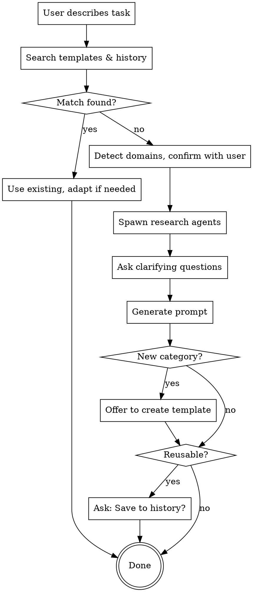

# Prompt Generator

## Overview

Transform investigation/discovery goals into **handoff-ready prompts** for Claude Code in Replit. This is **Part 1 of a 3-part workflow**:

1. **Part 1 (Here):** Define WHAT to investigate + WHICH skills to use → Create draft discovery prompt
2. **Part 2 (Replit):** Refine with full codebase context + codebase-specific details
3. **Part 3 (Replit):** Execute refined prompt autonomously → Generate discovery documents

Generated prompts are scaffolds, not final—they're designed to be refined in Replit with full codebase visibility. For reference, see: `Agent Knowledge/Guides/prompt-generator-replit-workflow.md`

**Key assumption:** Claude Code in Replit will have codebase access, so prompts focus on DISCOVERY DIRECTION, not implementation details.

## Workflow



## Step 1: Search Templates & History FIRST

**Before doing anything else**, search for existing prompts:

```
Prompts/
├── Prompt Templates/   ← Check here first for reusable patterns
└── Prompt History/     ← Check here for similar past prompts
```

**If a good match exists:**
- Use it directly or adapt slightly
- Skip all other steps
- Done

**If no match exists:**
- Continue to Step 2

## Step 2: Detect & Confirm Domains

Only if no template/history match was found.

Analyze the task description and infer relevant domains:
- Frontend (UI, React, styling)
- Backend (APIs, databases, architecture)
- Security (auth, validation, encryption)
- Research (market, competitor, user)
- Brainstorming (strategy, features, planning)

**Confirm with user:** "I see this involves [domains] - correct?"

## Step 3: Spawn Research Agents

Only if no template/history match was found.

Launch subagents concurrently using the Task tool:

| Agent | Purpose | When to Spawn |
|-------|---------|---------------|
| Prompt Best Practices Agent | Web research on prompt structure for this task type | For NEW task types |
| Domain Expert Agent(s) | Gather domain expertise | Based on detected domains |

**Domain Expert Agent mapping:**
- Security → web research on security best practices
- Market research → invoke `market-research-vc-intelligence` skill
- Frontend → invoke `frontend-design` skill
- EdTech/learning → invoke `edtech-learning-science` skill
- Backend → web research on architecture patterns for specific feature type
- Other → web research tailored to domain

## Step 4: Ask Clarifying Questions for Replit Handoff

Ask 3-4 questions using `AskUserQuestion` tool with multiple choice when possible. Focus on clarifying what Replit Claude Code needs to investigate:

1. **What's the discovery task?** (What should Replit Claude Code investigate in the codebase?)
   - Example: "Audit how context is passed to the LLM for this feature"
   - Example: "Trace data flow from database query → prompt assembly"
   - Example: "Identify all data sources available but not currently used"

2. **Which established skills should the prompt invoke?** (What pattern fits this task?)
   - Code-explorer for finding patterns?
   - Subagent-orchestration for parallel investigations?
   - TDD/systematic-debugging if there's a bug hypothesis?
   - Brainstorming if exploring multiple approaches?

3. **What project context matters?** (What terminology/patterns should the prompt reference?)
   - Which memory files? (business_context, major_memory, personal_preferences?)
   - Which architecture patterns? (ModelRouter, circuit breaker, RAG?)
   - Which standard procedures? (STANDARD_FEATURE_DEVELOPMENT_PROCEDURE?)
   - Any codebase-specific terminology?

4. **What should Part 2 (Replit refinement) focus on?** (What codebase details are still unknown?)
   - Specific files/functions to investigate?
   - Edge cases to consider?
   - Data flow patterns to trace?

## Step 5: Generate Prompt

Structure the prompt with these sections. Remember: This is a DISCOVERY SCAFFOLD for Replit refinement, not a final execution prompt.

```markdown
## Goal
[Clear statement: What should Replit Claude Code investigate?]

## Discovery Direction
[High-level guidance on investigation areas]
- What data sources to explore
- What patterns to look for
- What terminology matters in this codebase

## Context & Domain Knowledge
- [Domain-specific concepts]
- [Project architecture patterns to reference]
- [Common mistakes or gotchas]

## Project References
- **Memory files:** business_context, major_memory, [others]
- **Architecture patterns:** ModelRouter, circuit breaker, [others]
- **Standard procedures:** STANDARD_FEATURE_DEVELOPMENT_PROCEDURE

## Recommended Orchestration Pattern
[Which skills should Replit Claude Code use?]
- subagent-orchestration? (for parallel investigations)
- code-explorer? (for finding patterns)
- systematic-debugging? (if investigating bugs)

## Expected Output
[What discovery documents should result?]
[Example structure for Part 3 execution]

## Part 2 Refinement Notes
[What codebase details need to be filled in before execution?]
- Specific files/functions to investigate
- Edge cases to confirm
- Data flow patterns to trace
```

### Orchestration Guidelines

**Include orchestration when:**
- Task has distinct phases (audit → plan → implement)
- Multiple independent explorations can run in parallel
- Task requires both frontend and backend work
- Verification/debugging step needed after implementation

**Skip orchestration when:**
- Single-focus task (one file, one feature)
- Linear workflow with no parallelization benefit
- Simple bug fix or small change

**Available Subagents:**

| Agent | Use For |
|-------|---------|
| **Code Explorer** | Finding patterns, understanding existing code, locating files |
| **Code Architect** | Designing module structure, planning architecture |
| **Debugger** | Verifying implementation, tracking down issues |
| **Thoven Designer** | UI/UX decisions specific to Thoven's design system |
| **General Explorer** | Broad codebase exploration, answering "where is X?" |

**Orchestration patterns:**
- **Audit tasks:** Parallel explorers → Analysis → Implementation
- **Feature implementation:** Architect → Parallel frontend/backend → Debugger verification
- **Bug fixes:** Debugger to reproduce → Explorer to find root cause → Fix → Debugger to verify

**Format adapts** based on research about what works best for Claude Code + task type.

## Step 6: Template & Save Decisions

### New Category Detection
If this prompt represents a **new type/category** not in templates:
- Offer: "This seems like a new prompt category ([type]). Want me to create a template for future use?"
- If yes → Save to `Prompts/Prompt Templates/[task-type]-template.md`

### Save to History
Only ask to save if the prompt is **reusable or reference-worthy**:
- Complex multi-phase implementations
- Well-researched domain-specific prompts
- Prompts with significant embedded knowledge

**Don't save:**
- One-off exploration prompts
- Simple/quick prompts
- Prompts that are slight variations of templates

If worth saving: "Want to save this to Prompt History?"
- If yes → Save to `Prompts/Prompt History/YYYY-MM-DD-[task-summary].md`
- If no → Just provide in conversation, done

## Folder Structure

```
Prompts/
├── Prompt Templates/   ← Reusable patterns by task type
│   └── [task-type]-template.md
└── Prompt History/     ← Reference-worthy saved prompts
    └── YYYY-MM-DD-[task-summary].md
```

Located at: `/Users/andresmartinez/Vaults/Executive Assistant/Prompts/`

## The 3-Part Workflow

This skill produces **Part 1**. The full workflow is:

```
Part 1 (Here)              Part 2 (Replit)           Part 3 (Replit)
Define discovery      →    Refine with codebase →   Execute autonomously
axes + skills             specifics                 Spawn subagents
                          Discuss approach          Generate docs
```

For details, see: `Agent Knowledge/Guides/prompt-generator-replit-workflow.md`

## When to Use This Skill

✅ **Use when:**
- You have a discovery/investigation task
- You want to delegate to Replit Claude Code with subagent orchestration
- Output should be structured discovery documents
- Task is complex enough to benefit from multi-phase investigation

❌ **Don't use when:**
- You're directly implementing code (go to Replit, start Part 3)
- Task is simple enough for direct execution
- You already know exactly what needs to be done
- You just need to search the codebase quickly

## Key Principles

1. **This is Part 1, not the full prompt** - Designed for Replit refinement
2. **Search templates first** - Check templates/history before generating
3. **Embed discovery direction, not implementation** - Focus on WHAT to investigate
4. **Reference project context** - Memory files, architecture patterns, terminology
5. **Recommend skills, don't assume** - Ask which orchestration pattern fits
6. **Skip steps when possible** - Found a match? Use it and move on

## Example: Match Found

**User:** "Create a prompt to explore the backend for X"

**Skill searches:** Finds `backend-exploration-template.md` in Templates

**Response:** "Found an existing backend exploration template. Here it is adapted for your task: [prompt]. Let me know if you need changes."

**Done.** No agents spawned, no questions asked.

## Example: No Match Found

**User:** "Create a prompt for investigating model upgrade architecture"

**Skill searches:** No template found (new category)

**Skill detects:** This is a discovery/investigation task, not implementation

**Confirms:** "This is discovery work for Replit Claude Code - correct?"

**Asks clarifying questions:**
1. What should Replit Claude Code investigate? → "How context is passed to LLMs"
2. Which skills to invoke? → "subagent-orchestration for parallel investigations"
3. What project context matters? → "Memory files + architecture patterns + standard procedures"
4. What needs Replit refinement? → "Specific files to search + codebase patterns"

**Generates Part 1 prompt scaffold with:**
- Goal: Discover what architectural changes enable model upgrades
- Discovery direction: Context flow, data sources, validation logic
- Project references: business_context, ModelRouter, STANDARD_FEATURE_DEVELOPMENT_PROCEDURE
- Recommended orchestration: subagent-orchestration with 4 parallel investigators
- Expected output: 4 discovery documents per feature
- Part 2 refinement notes: Specific files to search, edge cases to investigate

**Output clarity:**
- "This is a handoff scaffold designed for Replit refinement"
- "Part 2 (Replit): You'll search the codebase and fill in specific files/patterns"
- "Part 3 (Replit): Claude Code executes the refined prompt autonomously"

**Offers:** "This is a new category (model upgrade analysis). Save as template?"

**Saves to history** (automatically - it's complex, reusable, well-researched)
