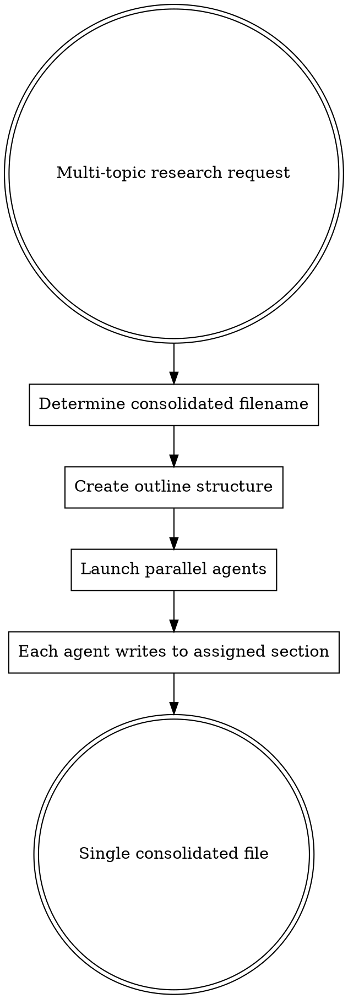

# Research Orchestration

## Overview

**When launching multiple research subagents, all results MUST go into ONE consolidated file.**

Default behavior creates one file per agent. This creates document sprawl and forces manual consolidation.

## The Iron Law

```
MULTIPLE RESEARCH AGENTS = ONE OUTPUT FILE
```

No exceptions. No separate files per agent.

## When to Use

Use this skill when:
- Launching 2+ subagents for research on related topics
- User asks to "research X, Y, and Z" (multiple topics)
- Doing multi-topic research yourself (WebSearch, Read, Grep across multiple domains)

**Use subagents when**:
- Topics require specialized expertise (legal analysis, technical deep-dives)
- Research depth exceeds what WebSearch can provide
- Sequential dependencies (Agent 2 needs Agent 1's findings)

**Do research directly when**:
- Simple web searches suffice
- Time pressure requires minimal coordination overhead
- You can synthesize as you go

**Core principle applies to both**: Whether delegating or researching yourself, multiple related topics = ONE consolidated file.

## Core Pattern

### Before (❌ Creates File Sprawl)

```markdown
User: "Research tax compliance, work authorization, and worker classification"

Claude launches 3 agents:
  Agent 1 → "Save to: Research/Tax Compliance.md"
  Agent 2 → "Save to: Research/Work Authorization.md"
  Agent 3 → "Save to: Research/Worker Classification.md"

Result: 3 separate files, manual consolidation required
```

### After (✅ Single Consolidated File)

```markdown
User: "Research tax compliance, work authorization, and worker classification"

Claude:
1. Determines consolidated filename FIRST
2. Creates outline with section structure
3. Launches 3 agents, each assigned to specific section
4. All agents write to SAME file (different sections)

Result: 1 file with 3 clear sections
```

## Implementation Workflow



### Step 1: Determine Consolidated Filename

**Before launching ANY agents**, decide on the single output file:

```markdown
# Pattern: [Domain] - [Scope/Context].md

Examples:
✅ "Legal Compliance - Comprehensive Guide for Thoven.md"
✅ "Marketplace Compliance - 2026 Requirements.md"
✅ "Competitor Analysis - Music Education Platforms.md"

❌ "Tax Compliance.md" (too narrow, implies separate files for other topics)
❌ "Research.md" (too generic)
```

**Filename should reflect ALL topics**, not just one.

### Step 2: Create Outline Structure

Write the file outline BEFORE launching agents:

```markdown
# [Title]

## Table of Contents
1. [Topic 1]
2. [Topic 2]
3. [Topic 3]
4. [Action Items & Next Steps]

---

## 1. [Topic 1]
[Agent 1 will research and write this section]

## 2. [Topic 2]
[Agent 2 will research and write this section]

## 3. [Topic 3]
[Agent 3 will research and write this section]

## Action Items & Next Steps
[Synthesize recommendations across all topics]
```

Use Write tool to create this outline file.

### Step 3: Launch Agents with Section Assignments

**Critical**: Each agent gets CLEAR instructions about:
1. Which section they're responsible for
2. The EXACT file path (same for all agents)
3. That other agents are working on other sections

**Agent prompt template**:

```
You are researching [TOPIC] as part of a larger research effort on [DOMAIN].

**Your section**: "## [Section Number]. [Section Title]"

**Output file**: [EXACT FILE PATH]

**Context**: Other agents are researching:
- Agent 2: [Topic 2]
- Agent 3: [Topic 3]

Your task:
1. Research [specific focus areas]
2. Write comprehensive analysis
3. Write your findings to the section "## [Section Number]. [Section Title]" in the output file
4. Use Edit tool to replace the placeholder with your research
5. DO NOT modify other sections - only your assigned section

**Format**:
- Start with overview/key findings
- Use subsections (###) for organization
- Include sources/citations at end of your section
```

### Step 4: Handle Agent Results

**When agents complete**:
- ✅ Review consolidated file to ensure all sections populated
- ✅ Add executive summary if needed
- ✅ Fill in "Action Items & Next Steps" section
- ❌ DO NOT create separate files
- ❌ DO NOT consolidate afterward (should already be one file)

## Edge Cases

### Different Domains (When to Split)

**Split into multiple files when topics are UNRELATED**:

```markdown
User: "Research marketplace legal compliance AND coffee shop market sizing"

These are unrelated domains:
- File 1: "Legal Compliance - Marketplace Guide.md"
- File 2: "Market Research - Coffee Shop Industry.md"
```

**Keep consolidated when topics are RELATED**:

```markdown
User: "Research tax compliance, worker classification, and state registration"

Same domain (legal compliance):
- File 1: "Legal Compliance - Comprehensive Guide.md" (all 3 topics)
```

**Rule of thumb**: If user would reference these together, consolidate. If completely different projects, split.

### Sequential Research (Not Parallel)

If agents must run sequentially (Agent 2 needs Agent 1's findings):

1. Still use single consolidated file
2. Agent 1 writes Section 1
3. Agent 2 reads Section 1, writes Section 2 (can reference Agent 1's findings)
4. Agent 3 reads Sections 1-2, writes Section 3

**Instruction for Agent 2**:
```
Before starting, read the file to see Agent 1's findings in Section 1.
Your research should build on or complement those findings.
Write your analysis to Section 2.
```

### Very Long Research (>50 pages)

If consolidated file would exceed 50 pages:

**Option 1**: Split by major domain (not by agent)
```
- "Legal Compliance - Tax & Classification.md" (topics 1-2)
- "Legal Compliance - Registration & Licensing.md" (topics 3-4)
```

**Option 2**: Create index file + detail files
```
- "Legal Compliance - Executive Summary.md" (index + key findings)
- "Legal Compliance - Detailed Analysis.md" (full research)
```

**Never split**: One file per agent (creates no thematic organization)

## Common Mistakes

| Mistake | Fix |
|---------|-----|
| **Launch agents before deciding filename** | Decide filename FIRST (Step 1) |
| **Each agent "decides" their own filename** | All agents use SAME file, assigned sections |
| **Create files then consolidate** | Create ONE file from the start |
| **Generic filename ("Research.md")** | Use domain-specific name reflecting all topics |
| **No section assignments** | Clear section boundaries in outline (Step 2) |
| **Agents overwrite each other** | Each agent edits ONLY their section |

## Rationalizations to Reject

| Excuse | Reality |
|--------|---------|
| "Separate files easier for parallel work" | Separate sections in ONE file work fine |
| "User can consolidate later" | User shouldn't have to - that's your job |
| "Each topic deserves its own file" | Related topics belong together |
| "Agents might conflict editing same file" | Section assignments prevent conflicts |
| "This is how I've always done it" | And it creates file sprawl every time |
| "These topics don't connect" | Investor DD/strategic planning requires cohesive narrative |
| "Planning wastes time under pressure" | 2 min planning saves 20 min consolidation later |
| "Topics are too diverse to consolidate" | If user asked together, they want integrated view |

## Real-World Impact

**Before this skill** (from actual session):
- User request: Research 4 legal topics
- Result: 4 separate files, ~40,000 words
- User feedback: "This has happen d a couple iof times...causing way to many documents to be created"
- Manual consolidation required

**After this skill**:
- Same request: Research 4 legal topics
- Result: 1 consolidated file with 4 sections
- No manual consolidation needed
- Easy to reference, maintain, update

## Quick Reference

```
1. Filename FIRST (reflects all topics)
2. Create outline (section per agent)
3. Launch agents with section assignments
4. All agents → same file, different sections
5. Review consolidated result
```

**Remember**: Multiple research agents = ONE output file. Always.
